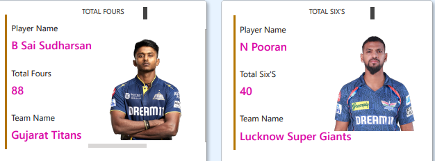

**IPL Analysis Power BI Report**

Overview

This report outlines the process of creating an IPL Data Analytics
report in Power BI using a compiled IPL summary data source (2008–2025)
with columns such as Season, Team Name, Player Name, Runs, Sixes, Fours,
Matches, Wins, Losses, etc.

It provides rich analysis using interactive visualizations, slicers,
team/player images, team logos, and dynamic season selectors.

**Data Transformations**

**Imported Data**

Loaded IPL datasets into Power BI:

BALL_BY_BALL_DATA.csv

IPL_MATCHES_DATA.csv

PLAYERS-DATA-UPDATED.csv

TEAM_DATA.csv

The data used was clean, well-structured, and entirely error-free; no
data transformations were necessary prior to analysis.

**Data Model**

All columns/data were used as provided.

No column-type fixes or table relationship corrections were needed.

Calculated fields and DAX formulas were implemented directly for
analytical visuals (like total points, top N rankings, etc.).

**Analyses and Visualizations**

**1. Winner & Runner-Up Teams Per Season**

Objective: For a selected season, show the winner and runner-up with
dynamic team logos.

Visualization: Card, image, and text display, updated by season slicer

DAX QUERY  
SEASON WINNER  
Season winner Logo =

VAR SelectedSeason = SELECTEDVALUE(ipl_matches_data\[season\])

VAR FinalMatchDate = CALCULATE(MAX(ipl_matches_data\[match_date\]),

                               ipl_matches_data\[season\] =
SelectedSeason)

VAR FinalMatchWinner = CALCULATE(MAX(ipl_matches_data\[match_winner\]),

                                  ipl_matches_data\[season\] =
SelectedSeason ,

                                  ipl_matches_data\[match_date\]=
FinalMatchDate )

RETURN

LOOKUPVALUE(

    teams_data\[image_url\],

    teams_data\[team_name\], FinalMatchWinner)

RUNNER-UP

Runner up =

VAR SelectedSeason = SELECTEDVALUE(ipl_matches_data\[season\])

VAR FinalMatchDate = CALCULATE(MAX(ipl_matches_data\[match_date\]),

                               ipl_matches_data\[season\] =
SelectedSeason)

VAR FinalMatchWinner = CALCULATE(MAX(ipl_matches_data\[match_winner\]),

                                  ipl_matches_data\[season\] =
SelectedSeason ,

                                  ipl_matches_data\[match_date\]=
FinalMatchDate )

VAR Team1 =  CALCULATE(MAX(ipl_matches_data\[team1\]),

                                ipl_matches_data\[season\] =
SelectedSeason ,

                                  ipl_matches_data\[match_date\]=
FinalMatchDate )

VAR Team2 =  CALCULATE(MAX(ipl_matches_data\[team2\]),

                                  ipl_matches_data\[season\] =
SelectedSeason ,

                                  ipl_matches_data\[match_date\]=
FinalMatchDate )

RETURN

IF(FinalMatchWinner=Team1,Team2,Team1)

FOR LOGOS OF THE TEAM  
Runner up =

VAR SelectedSeason = SELECTEDVALUE(ipl_matches_data\[season\])

VAR FinalMatchDate = CALCULATE(MAX(ipl_matches_data\[match_date\]),

                               ipl_matches_data\[season\] =
SelectedSeason)

VAR FinalMatchWinner = CALCULATE(MAX(ipl_matches_data\[match_winner\]),

                                  ipl_matches_data\[season\] =
SelectedSeason ,

                                  ipl_matches_data\[match_date\]=
FinalMatchDate )

VAR Team1 =  CALCULATE(MAX(ipl_matches_data\[team1\]),

                                  ipl_matches_data\[season\] =
SelectedSeason ,

                                  ipl_matches_data\[match_date\]=
FinalMatchDate )

VAR Team2 =  CALCULATE(MAX(ipl_matches_data\[team2\]),

                                  ipl_matches_data\[season\] =
SelectedSeason ,

                                  ipl_matches_data\[match_date\]=
FinalMatchDate )

RETURN

IF(FinalMatchWinner=Team1,Team2,Team1)

Season winner Logo =

VAR SelectedSeason = SELECTEDVALUE(ipl_matches_data\[season\])

VAR FinalMatchDate = CALCULATE(MAX(ipl_matches_data\[match_date\]),

                               ipl_matches_data\[season\] =
SelectedSeason)

VAR FinalMatchWinner = CALCULATE(MAX(ipl_matches_data\[match_winner\]),

                                  ipl_matches_data\[season\] =
SelectedSeason ,

                                  ipl_matches_data\[match_date\]=
FinalMatchDate )

RETURN

LOOKUPVALUE(

    teams_data\[image_url\],

    teams_data\[team_name\], FinalMatchWinner)

THE TEAM AND THE DATA DISPLAYED IN THE DASHBOARD CAN BE CHANGED USING A
SLICER

**2. Orange Cap Statistics**

**Objective**: For a selected season, show:

- Orange Cap holder, runs scored, team name, player image

**Visualization**: Card (player name), dynamic image (player photo),
card (team), card (runs)

DAX QUERY

Orange Cap Holder =

 VAR SelectedSeason = SELECTEDVALUE(ipl_matches_data\[season\])

 VAR SeasonDataOnly =

                   
 FILTER(ball_by_ball_data,RELATED(ipl_matches_data\[season\]) =
SelectedSeason)

VAR RunSummary =

               
SUMMARIZE(SeasonDataOnly,ball_by_ball_data\[batter\],"Total
Runs",SUM(ball_by_ball_data\[batter_runs\]))

VAR MaxRuns = MAXX(RunSummary,\[Total Runs\])

VAR TopScorer =

             
 CALCULATETABLE(VALUES(ball_by_ball_data\[batter\]),FILTER(RunSummary,\[Total
Runs\] = MaxRuns))

RETURN MAXX(TopScorer,ball_by_ball_data\[batter\])

Orange Cap Image =

 VAR SelectedSeason = SELECTEDVALUE(ipl_matches_data\[season\])

 VAR SeasonDataOnly =

                   
 FILTER(ball_by_ball_data,RELATED(ipl_matches_data\[season\]) =
SelectedSeason)

VAR RunSummary =

               
SUMMARIZE(SeasonDataOnly,ball_by_ball_data\[batter\],"Total
Runs",SUM(ball_by_ball_data\[batter_runs\]))

VAR MaxRuns = MAXX(RunSummary,\[Total Runs\])

VAR TopScorer =

             
 CALCULATETABLE(VALUES(ball_by_ball_data\[batter\]),FILTER(RunSummary,\[Total
Runs\] = MaxRuns))

RETURN

LOOKUPVALUE('players-data-updated'\[player_image\],'players-data-updated'\[player_name\],MAXX(TopScorer,ball_by_ball_data\[batter\]))

Orange Cap Runs =

 VAR SelectedSeason = SELECTEDVALUE(ipl_matches_data\[season\])

 VAR SeasonDataOnly =

                   
 FILTER(ball_by_ball_data,RELATED(ipl_matches_data\[season\]) =
SelectedSeason)

VAR RunSummary =

               
SUMMARIZE(SeasonDataOnly,ball_by_ball_data\[batter\],"Total
Runs",SUM(ball_by_ball_data\[batter_runs\]))

VAR MaxRuns = MAXX(RunSummary,\[Total Runs\])

RETURN MaxRuns

Orange Cap Team Name =

 VAR SelectedSeason = SELECTEDVALUE(ipl_matches_data\[season\])

 VAR SeasonDataOnly =

                   
 FILTER(ball_by_ball_data,RELATED(ipl_matches_data\[season\]) =
SelectedSeason)

VAR RunSummary =

               
SUMMARIZE(SeasonDataOnly,ball_by_ball_data\[batter\],"Total
Runs",SUM(ball_by_ball_data\[batter_runs\]))

VAR MaxRuns = MAXX(RunSummary,\[Total Runs\])

VAR TopScorer =

             
 CALCULATETABLE(VALUES(ball_by_ball_data\[batter\]),FILTER(RunSummary,\[Total
Runs\] = MaxRuns))

VAR FullTeamName =

             
CALCULATE(MAX(ball_by_ball_data\[team_batting\]),FILTER(SeasonDataOnly,ball_by_ball_data\[batter\]
= MAXX(TopScorer,ball_by_ball_data\[batter\])))

RETURN

FullTeamName

**3. Purple Cap Statistics**

**Objective**: For a selected season, show:

- Purple Cap holder, wickets taken, team name, player image

**Visualization**: Card (player name), dynamic image (player photo),
card (team), card (wickets)

DAX QUERY

PurpleCapHolder =

VAR SelectedSeason = SELECTEDVALUE(ipl_matches_data\[season\])

VAR SeasonWickets =

    FILTER(

        ball_by_ball_data,

        RELATED(ipl_matches_data\[season\]) = SelectedSeason &&

        ball_by_ball_data\[is_wicket\] = TRUE() &&

        NOT ball_by_ball_data\[wicket_kind\] IN { "run out", "retired
hurt", "obstructing the field","retired out"}

    )

VAR WicketSummary =

    SUMMARIZE(

        SeasonWickets,

        ball_by_ball_data\[bowler\],

        "WicketCount", COUNTROWS(

            FILTER(SeasonWickets, ball_by_ball_data\[bowler\] =
EARLIER(ball_by_ball_data\[bowler\]))

        )

    )

VAR MaxWickets = MAXX(WicketSummary, \[WicketCount\])

VAR TopBowler =

    CALCULATETABLE(

        VALUES(ball_by_ball_data\[bowler\]),

        FILTER(WicketSummary, \[WicketCount\] = MaxWickets)

    )

RETURN

    MAXX(TopBowler, ball_by_ball_data\[bowler\])

PurpleCapImage =

VAR SelectedSeason = SELECTEDVALUE(ipl_matches_data\[season\])

VAR SeasonWickets =

    FILTER(

        ball_by_ball_data,

        RELATED(ipl_matches_data\[season\]) = SelectedSeason &&

        ball_by_ball_data\[is_wicket\] = TRUE() &&

        NOT ball_by_ball_data\[wicket_kind\] IN {

            "run out",

            "retired hurt",

            "retired out",

            "obstructing the field"

        }

    )

VAR WicketSummary =

    SUMMARIZE(

        SeasonWickets,

        ball_by_ball_data\[bowler\],

        "WicketCount", COUNTROWS(

            FILTER(

                SeasonWickets,

                ball_by_ball_data\[bowler\] =
EARLIER(ball_by_ball_data\[bowler\])

            )

        )

    )

VAR MaxWickets = MAXX(WicketSummary, \[WicketCount\])

VAR TopBowler =

    CALCULATETABLE(

        VALUES(ball_by_ball_data\[bowler\]),

        FILTER(WicketSummary, \[WicketCount\] = MaxWickets)

    )

RETURN

    LOOKUPVALUE(

        'players-data-updated'\[player_image\],

        'players-data-updated'\[player_name\], MAXX(TopBowler,
ball_by_ball_data\[bowler\])

    )

PurpleCapTeam =

VAR SelectedSeason = SELECTEDVALUE(ipl_matches_data\[season\])

VAR SeasonWickets =

    FILTER(

        ball_by_ball_data,

        RELATED(ipl_matches_data\[season\]) = SelectedSeason &&

        ball_by_ball_data\[is_wicket\] = TRUE() &&

        NOT ball_by_ball_data\[wicket_kind\] IN {

            "run out",

            "retired hurt",

            "retired out",

            "obstructing the field"

        }

    )

VAR WicketSummary =

    ADDCOLUMNS(

        SUMMARIZE(

            SeasonWickets,

            ball_by_ball_data\[bowler\],

            ball_by_ball_data\[team_bowling\]

        ),

        "WicketCount",

        COUNTROWS(

            FILTER(

                SeasonWickets,

                ball_by_ball_data\[bowler\] =
EARLIER(ball_by_ball_data\[bowler\])

            )

        )

    )

VAR MaxWickets = MAXX(WicketSummary, \[WicketCount\])

RETURN

    MAXX(

        FILTER(WicketSummary, \[WicketCount\] = MaxWickets),

        ball_by_ball_data\[team_bowling\]

    )

PurpleCapWicketCount =

VAR SelectedSeason = SELECTEDVALUE(ipl_matches_data\[season\])

VAR SeasonWickets =

    FILTER(

        ball_by_ball_data,

        RELATED(ipl_matches_data\[season\]) = SelectedSeason &&

        ball_by_ball_data\[is_wicket\] = TRUE() &&

        NOT ball_by_ball_data\[wicket_kind\] IN { "run out", "retired
hurt", "retired out", "obstructing the field"

        }

    )

VAR WicketSummary =

    SUMMARIZE(

        SeasonWickets,

        ball_by_ball_data\[bowler\],

        "WicketCount", COUNTROWS(

            FILTER(

                SeasonWickets,

                ball_by_ball_data\[bowler\] =
EARLIER(ball_by_ball_data\[bowler\])

            )

        )

    )

VAR MaxWickets = MAXX(WicketSummary, \[WicketCount\])

RETURN

    MaxWickets

**4. Maximum Fours/Sixes in Season**

**Objective**:

- Show player with most fours in season, fours tally, team, and image

- Show player with most sixes in season, sixes tally, team, and image

**Visualization**: Separate "Highest Fours" and "Highest Sixes"
cards/images per season

DAX QUERY

Total Fours Count =

VAR SelectedSeason = SELECTEDVALUE(ipl_matches_data\[season\])

VAR SeasonFours =
FILTER(ball_by_ball_data,RELATED(ipl_matches_data\[season\])=
SelectedSeason &&

                         ball_by_ball_data\[batter_runs\]= 4)

VAR FourSummary =
SUMMARIZE(SeasonFours,ball_by_ball_data\[batter\],"FoursCount",

     
COUNTROWS(FILTER(SeasonFours,ball_by_ball_data\[batter\]=EARLIER(ball_by_ball_data\[batter\]))))

VAR MaxFours = MAXX(FourSummary,\[FoursCount\])

RETURN MaxFours

Total Fours Player Image =

VAR SelectedSeason = SELECTEDVALUE(ipl_matches_data\[season\])

VAR SeasonFours =
FILTER(ball_by_ball_data,RELATED(ipl_matches_data\[season\])=
SelectedSeason &&

                         ball_by_ball_data\[batter_runs\]= 4)

VAR FourSummary =
SUMMARIZE(SeasonFours,ball_by_ball_data\[batter\],"FoursCount",        
             
COUNTROWS(FILTER(SeasonFours,ball_by_ball_data\[batter\]=EARLIER(ball_by_ball_data\[batter\]))))

VAR MaxFours = MAXX(FourSummary,\[FoursCount\])

VAR TopFoursPlayer = CALCULATETABLE(VALUES(ball_by_ball_data\[batter\]),

                                   
FILTER(FourSummary,\[FoursCount\]=MaxFours))

RETURN

    LOOKUPVALUE(

        'players-data-updated'\[player_image\],

        'players-data-updated'\[player_name\], MAXX(TopFoursPlayer,
ball_by_ball_data\[batter\])

    )

Total Six Count =

VAR SelectedSeason = SELECTEDVALUE(ipl_matches_data\[season\])

VAR SeasonFours =
FILTER(ball_by_ball_data,RELATED(ipl_matches_data\[season\])=
SelectedSeason &&

                         ball_by_ball_data\[batter_runs\]= 6)

VAR FourSummary =
SUMMARIZE(SeasonFours,ball_by_ball_data\[batter\],"FoursCount",

                     
COUNTROWS(FILTER(SeasonFours,ball_by_ball_data\[batter\]=EARLIER(ball_by_ball_data\[batter\]))))

VAR MaxFours = MAXX(FourSummary,\[FoursCount\])

RETURN MaxFours

Total Six Player Image =

VAR SelectedSeason = SELECTEDVALUE(ipl_matches_data\[season\])

VAR SeasonFours =
FILTER(ball_by_ball_data,RELATED(ipl_matches_data\[season\])=
SelectedSeason &&

                         ball_by_ball_data\[batter_runs\]= 6)

VAR FourSummary =
SUMMARIZE(SeasonFours,ball_by_ball_data\[batter\],"FoursCount",

                           
COUNTROWS(FILTER(SeasonFours,ball_by_ball_data\[batter\]=EARLIER(ball_by_ball_data\[batter\]))))

VAR MaxFours = MAXX(FourSummary,\[FoursCount\])

VAR TopFoursPlayer = CALCULATETABLE(VALUES(ball_by_ball_data\[batter\]),

                                   
FILTER(FourSummary,\[FoursCount\]=MaxFours))

RETURN

    LOOKUPVALUE(

        'players-data-updated'\[player_image\],

        'players-data-updated'\[player_name\], MAXX(TopFoursPlayer,
ball_by_ball_data\[batter\])

    )

**5. Points Table**

**Objective**: For a selected season, show team leaderboard with:

- Logo, Team name, Matches, Wins, Losses, NR, Tie, Total Points

- Calculated using official IPL formula:  
  Total Points=(Wins×2)+(Ties×1)+(NR×1)Total Points=(Wins×2)+(Ties×1)+(NR×1)

**Visualization**: Table with all columns, dynamic per season

DAX QUERY

Matches Lost =

 VAR SelectedSeason = SELECTEDVALUE(ipl_matches_data\[season\])

 VAR Team1LostMatches =

                     CALCULATE(COUNTROWS(ipl_matches_data),

                   
USERELATIONSHIP(ipl_matches_data\[team1\],teams_data\[team_name\]),

                    ipl_matches_data\[season\] = SelectedSeason,

                    ipl_matches_data\[match_type\] = "T20",

                    NOT ISBLANK(ipl_matches_data\[match_winner\]),

                    ipl_matches_data\[match_winner\] \<\>
ipl_matches_data\[team1\]

                    )

 VAR Team2LostMatches =

                    CALCULATE(COUNTROWS(ipl_matches_data),

                   
USERELATIONSHIP(ipl_matches_data\[team2\],teams_data\[team_name\]),

                    ipl_matches_data\[season\] = SelectedSeason,

                    ipl_matches_data\[match_type\] = "T20",

                    NOT ISBLANK(ipl_matches_data\[match_winner\]),

                    ipl_matches_data\[match_winner\] \<\>
ipl_matches_data\[team2\]

                    )

RETURN Team1LostMatches + Team2LostMatches

Matches Played =

 VAR SelectedSeason = SELECTEDVALUE(ipl_matches_data\[season\])

 VAR Team1Matches =

                    CALCULATE(COUNTROWS(ipl_matches_data),

                   
USERELATIONSHIP(ipl_matches_data\[team1\],teams_data\[team_name\]),

                    ipl_matches_data\[season\] = SelectedSeason,

                    ipl_matches_data\[match_type\] = "T20")

 VAR Team2Matches =

                    CALCULATE(COUNTROWS(ipl_matches_data),

                   
USERELATIONSHIP(ipl_matches_data\[team2\],teams_data\[team_name\]),

                    ipl_matches_data\[season\] = SelectedSeason,

                    ipl_matches_data\[match_type\] = "T20")

RETURN Team1Matches + Team2Matches

Matches Won =

 VAR SelectedSeason = SELECTEDVALUE(ipl_matches_data\[season\])

 VAR CurrentTeam = SELECTEDVALUE(teams_data\[team_name\])

RETURN

 CALCULATE(COUNTROWS(ipl_matches_data),

           ipl_matches_data\[season\] = SelectedSeason,

           ipl_matches_data\[match_winner\] = CurrentTeam,

           ipl_matches_data\[match_type\] = "T20")

No Result  Played =

 VAR SelectedSeason = SELECTEDVALUE(ipl_matches_data\[season\])

 VAR Team1Matches =

                    CALCULATE(COUNTROWS(ipl_matches_data),

                   
USERELATIONSHIP(ipl_matches_data\[team1\],teams_data\[team_name\]),

                    ipl_matches_data\[season\] = SelectedSeason,

                    ipl_matches_data\[match_type\] = "T20",

                    ipl_matches_data\[result\] = "no result")

 VAR Team2Matches =

                    CALCULATE(COUNTROWS(ipl_matches_data),

                   
USERELATIONSHIP(ipl_matches_data\[team2\],teams_data\[team_name\]),

                    ipl_matches_data\[season\] = SelectedSeason,

                    ipl_matches_data\[match_type\] = "T20",

                    ipl_matches_data\[result\] = "no result")

RETURN Team1Matches + Team2Matches

**6. Secondary KPI Cards**

Objective: Display next-level stats for each season:

- **Total Sixes**

- **Total Fours**

- **Total Matches Played**

- **Total Teams**

- **Total Centuries**

- **Total Half-Centuries**

- **Total Venues**

**Visualization**: KPI cards, updated as per selected season slicer

DAX QUERY

Centuries =

 VAR SelectedSeason = SELECTEDVALUE(ipl_matches_data\[season\])

 VAR SeasonData = FILTER(ball_by_ball_data,

                         RELATED(ipl_matches_data\[season\]) =
SelectedSeason)

VAR BatterRuns =

            SUMMARIZE(SeasonData, ball_by_ball_data\[match_id\],

                      ball_by_ball_data\[batter\], "TotalRuns",
SUM(ball_by_ball_data\[batter_runs\]))

VAR CenturyCount = FILTER(BatterRuns, \[TotalRuns\] \>= 100)

RETURN COUNTROWS(CenturyCount)

Half Centuries =

 VAR SelectedSeason = SELECTEDVALUE(ipl_matches_data\[season\])

 VAR SeasonData = FILTER(ball_by_ball_data,

                         RELATED(ipl_matches_data\[season\]) =
SelectedSeason)

VAR BatterRuns =

            SUMMARIZE(SeasonData, ball_by_ball_data\[match_id\],

                      ball_by_ball_data\[batter\], "TotalRuns",
SUM(ball_by_ball_data\[batter_runs\]))

VAR CenturyCount = FILTER(BatterRuns, \[TotalRuns\] \>= 50 &&
\[TotalRuns\] \< 100)

RETURN COUNTROWS(CenturyCount)

Total 4's =

CALCULATE(COUNTROWS(ball_by_ball_data),ball_by_ball_data\[batter_runs\]=4,

           KEEPFILTERS(VALUES(ipl_matches_data\[season\])))

Total 6's =

CALCULATE(COUNTROWS(ball_by_ball_data),ball_by_ball_data\[batter_runs\]=6,

           KEEPFILTERS(VALUES(ipl_matches_data\[season\])))

Total Matches = CALCULATE(DISTINCTCOUNT(ipl_matches_data\[match_id\]))

Total Teams = CALCULATE(DISTINCTCOUNT(ipl_matches_data\[team1\] ))

Total Venues =

 CALCULATE(DISTINCTCOUNT(ipl_matches_data\[venue\]))

**7. Slicers & Filters**

- **Season Slicer (2008–2025)**: Select season, all visuals update

**SUMMARY**

This project presents an interactive Power BI dashboard for IPL analysis
based on clean, comprehensive cricket datasets covering IPL seasons from
2008 to 2025.  
No data transformations were required—direct CSV imports
(BALL_BY_BALL_DATA.csv, IPL_MATCHES_DATA.csv, PLAYERS-DATA-UPDATED.csv, TEAM_DATA.csv)
enabled instant, accurate visual exploration.

**Key Features:**

- Dynamic selection of any IPL season to instantly view the winner and
  runner-up teams (with logos)

- Top player stats including Orange Cap (most runs), Purple Cap (most
  wickets), maximum fours/sixes (with player images and teams)

- Full points table (matches played, wins, losses, ties, no results,
  points) for all teams per season, using official IPL rules

- Secondary KPIs: total sixes, fours, matches played, teams, centuries,
  half-centuries, venues

- All analytics powered by robust DAX queries and interactive Power BI
  visuals (cards, tables, images, slicers)

**Explore IPL history, team and player performances, and full league
trends using this fully dynamic Power BI dashboard.**

